# RoboFleet Fault Detection

RoboFleet Fault Detection is an offline machine learning and MLOps system for identifying observed fault-state behavior in fixed-wing unmanned aircraft telemetry. It uses the CMU ALFA dataset to build time-window features, evaluates models with recording-date isolation, calibrates an alert threshold from normal operating periods, registers a verified model in MLflow, serves it through FastAPI, packages it in Docker, records prediction events and produces drift reports with Evidently.

The system answers a specific question : 

> Given a completed telemetry window, does the aircraft's behavior resemble confirmed normal operation or an observed post-fault state?

This is fault-state detection, not failure forecasting. A high score means that a completed window resembles behavior observed after a recorded fault signal. The project does not claim to predict a fault before activation, diagnose its physical cause or provide a certified flight-safety function.

## Why this problem matters

Aircraft produce many telemetry streams at different rates : position, velocity, attitude, battery state, actuator commands, measured responses, wind estimates and other signals. A fault may not be obvious in any single reading. Its effect can instead appear as a change in variability, an unusual movement or a persistent difference from the aircraft's earlier behavior.

The project turns those asynchronous signals into a consistent sequence of seven-second summaries. A classifier assigns each summary a fault-state score and an alert is raised when that score reaches the configured threshold.

For a non-technical interpretation : 

- A **telemetry window** is a short report describing seven seconds of flight.
- A **feature** is one number in that report, such as average airspeed, change in roll or deviation from the flight's initial baseline.
- A **fault score** indicates how strongly the model associates the window with the observed fault-state class.
- An **alert threshold** converts that score into a yes-or-no alert.
- A **false alert** occurs when any confirmed normal-state window in a flight period crosses the threshold.
- A **detection delay** measures the time from the first recorded fault signal to the end of the first alerted window.

## System overview

```mermaid
flowchart LR
    S3[ALFA objects in Amazon S3]
    ACQ[Verified acquisition manifest]
    VAL[Inventory and structural validation]
    REF[Flight, topic and feature references]
    WIN[Seven-second telemetry windows]
    TRAIN[Date-grouped model training and evaluation]
    MLF[MLflow runs and artifacts]
    REG[Verified registered model version]
    BUNDLE[Immutable serving bundle]
    API[FastAPI prediction service]
    STORE[(SQLite prediction events)]
    MON[Evidently drift report]

    S3 --> ACQ --> VAL --> REF --> WIN --> TRAIN --> MLF --> REG --> BUNDLE --> API
    API --> STORE --> MON
    WIN --> MON
```



The major design principle is traceability. The serving response can be connected to a concrete registered model version, its prediction contract, the MLflow source run, the exact curated dataset bytes and the verified S3 acquisition records used to reconstruct those bytes.

## Dataset and data quality

This project uses the [Air Lab Failure and Anomaly dataset](https://github.com/castacks/alfa-dataset) created by Azarakhsh Keipour, Mohammadreza Mousaei and Sebastian Scherer. Dataset details and the associated publication are available from the [Carnegie Mellon Robotics Institute](https://publications.ri.cmu.edu/alfa-a-dataset-for-uav-fault-and-anomaly-detection).

The configured S3 dataset contains four sections. The modeling workflow uses the processed section by default.

| Section | Expected contents |
|---|---:|
| Processed | 47 flight directories, 1,590 CSV files, 47 MAT files and 47 ROS bag files |
| Raw | 39 ROS bag files |
| Telemetry | 41 TLOG files and 35 parameter files |
| Dataflash | 10 BIN files |

The processed acquisition contains 1,684 objects. Each acquired object is represented in `dataset_acquisition_manifest.json` with its S3 identity, local path, byte size and local SHA-256 digest. The downloader rehashes existing files before reuse, rejects changes to a previously acquired object inventory, validates S3 response metadata, checks full-object S3 SHA-256 values when available and publishes downloads only after writing and validating a temporary file.

The structural assessment found : 

- 47 flight recordings across five recording dates.
- 39 distinct telemetry topics.
- 28 topics satisfying the structural eligibility rules.
- 27 topics containing at least one usable numeric training column.
- 391 selected source columns.
- 10 no-failure flights.
- 36 fault flights with usable fault-status timing.
- one flight excluded because ground truth was unavailable.

`diagnostics.csv` contains 55 malformed rows across two files and `mavlink-from.csv` contains 717,988 structurally malformed rows across 47 files. The feature-reference rules exclude topics with parse errors, inconsistent schemas, incomplete flight coverage, label information or recovery artifacts. Failure-status topics are used only to establish labels and are never included as model inputs. The emergency-response trajectory file is also excluded to avoid learning from a recovery action that would not be available as ordinary telemetry evidence.

The fault-flight distribution is : 

| Fault family | Flights |
|---|---:|
| Engine | 23 |
| Aileron | 7 |
| Rudder | 3 |
| Elevator | 2 |
| Multiple control surfaces | 1 |

## Window construction and labels

Telemetry is converted into overlapping seven-second windows with a one-second step. Consecutive windows therefore share six seconds of observations. This overlap produces frequent scores while retaining enough context to describe short-term motion.

For each source signal, the dataset records : 

- mean.
- sample standard deviation.
- minimum and maximum.
- first and last values.
- change from the first value to the last value.

Command-response features are also calculated for airspeed, pitch, roll and yaw. These features measure the difference between commanded and measured behavior. Yaw error uses the shortest signed angular difference across the -180/180-degree boundary. Root-mean-square, mean-absolute and maximum-absolute errors supplement the standard window statistics.

Two causal reference representations describe how the current window differs from earlier behavior : 

1. **Initial-baseline delta :** the current mean minus the median of the first ten windows from the same flight.
2. **Trailing-history delta :** the current mean minus a rolling median of earlier windows.

Historical values are shifted by seven window steps so that the reference interval ends before the current seven-second window begins. The first 16 windows of each flight are removed because they do not yet have sufficient causal history. This prevents future observations and overlapping current-window data from entering historical reference features.

The V3 dataset contains 3,630 windows and 3,567 engineered feature columns : 

| Window label | Meaning | Count |
|---|---|---:|
| `normal` | Window from a no-failure flight | 322 |
| `pre_fault_state` | Fault-flight window ending before the confirmed transition boundary | 2,546 |
| `fault_state` | Window starting at or after the first recorded fault-status signal | 499 |
| `unlabeled` | Window overlapping the uncertain transition interval | 263 |

The construction uses a 0.2-second allowance between physical activation and the first recorded failure-status message. A fault-flight window is considered confirmed pre-fault only when it ends no later than the first signal time minus this allowance. A post-fault window must start at or after the recorded signal. Windows crossing the uncertain interval remain unlabeled.

Normal and confirmed pre-fault windows are training negatives. Fault-state windows are positives. Transition windows are excluded from supervised fitting but remain available when evaluating chronological alert behavior.

## Modeling approach

### Normal-behavior anomaly baselines

Isolation Forest and PCA reconstruction models provide unsupervised baselines. They learn from no-failure and confirmed pre-fault windows, then assign larger scores to unusual telemetry. Evaluation holds out an entire recording date and compares normal-state flights with fault-state flights from that same date.

| Baseline | Mean flight-pair ROC-AUC | Standard deviation |
|---|---:|---:|
| Isolation Forest | 0.8264 | 0.2664 |
| PCA reconstruction | 0.5832 | 0.3039 |

Isolation Forest was stronger, but its large variation across comparisons showed that generic unusualness was not sufficiently stable for the primary detector. These pairwise anomaly metrics are exploratory and are not directly comparable with the supervised flight-level results.

### Supervised fault-state classifier

The primary model is a LightGBM binary classifier with a `VarianceThreshold` preprocessing step. Logistic regression configurations and several constrained LightGBM configurations are evaluated on the same outer folds. The primary configuration is fixed while comparing feature representations so that an apparent improvement is attributable to the representation rather than a different model search.

The selected model configuration uses : 

- 200 boosting estimators.
- learning rate 0.03.
- seven leaves.
- minimum 20 samples per child.
- L2 regularization of 1.0.
- column subsampling of 0.8.
- random seed 42.

The selected `dynamic_plus_initial_baseline` representation contains 1,173 inputs : 

- short-window standard deviations and changes from the 391 source signals.
- initial-baseline deltas for the 391 source-signal means.

The fitted variance filter retains 403 nonconstant features.

The training command also supports controlled comparisons using `raw`, `dynamic_only`, `command_response_only`, `initial_baseline_only`, `trailing_history_only`, `dynamic_plus_initial_baseline`, `dynamic_plus_command_response`, `relative_dynamic` and `combined`. These names describe explicit, reproducible column-selection rules rather than manually maintained feature lists.

### Flight-balanced learning

Overlapping windows create many correlated examples and flights have different durations. Treating every window equally would allow long flights to dominate training. The weighting scheme therefore : 

1. gives the normal and fault classes equal total influence.
2. gives each flight within a class equal influence.
3. divides each flight's weight across its windows.
4. rescales the resulting weights to a mean of one.

This does not make overlapping windows independent. It prevents flight duration and class window counts from deciding the model fit by themselves.

### Recording-date isolation

All evaluation uses leave-one-recording-date-out splits. For each of five folds, every flight recorded on one date is held out while the model trains on the other dates. This is stricter than randomly splitting windows or flights because flights recorded together can share weather, instrumentation, configuration or operating conditions.

Feature preprocessing, model fitting and threshold calibration are performed without using the held-out date. Flight-level ROC-AUC aggregates window scores by the median and compares no-failure flights with post-fault portions of fault flights.

## Alert calibration

ROC-AUC measures ranking across all possible thresholds. It does not specify how many false alerts will occur after choosing one threshold. The operating-point analysis therefore treats threshold selection as a separate problem.

Within each outer training partition, additional recording-date-held-out predictions are generated for confirmed normal-state periods. Each flight or pre-fault period is represented by its maximum fault score, because one threshold crossing is enough to produce a false alert. The most sensitive threshold satisfying the requested calibration alert budget is selected, then applied once to the untouched outer date.

The serving model uses a target normal-state alert budget of 0.10 and stores the full-training calibrated threshold : 

```text
fault score >= 0.09687313511718001
```

This threshold is marked `cross_validated_calibration_without_external_validation`. It is a reproducible operating choice derived from the available data, not a guarantee of a 10% false-alert rate on future aircraft or environments.

## Selected model results

The registered model originates from MLflow run `6505151bcb8b4e658dea78f0da5ae712`.

| Metric | Result |
|---|---:|
| Mean window ROC-AUC across dates | 0.9964 |
| Window ROC-AUC standard deviation | 0.0068 |
| Mean flight ROC-AUC across dates | 0.9949 |
| Flight ROC-AUC standard deviation | 0.0103 |
| Worst-date flight ROC-AUC | 0.9744 |
| Pooled out-of-fold flight ROC-AUC | 0.9556 |

The mean fold AUC is very high, but the alert operating point gives a more concrete view of behavior. With independently calibrated thresholds in each held-out fold at the 0.10 target budget : 

| Operating metric | Result | 95% Wilson interval |
|---|---:|---:|
| Post-fault flights detected | 33/36 (91.67%) | 78.17%–97.13% |
| Combined normal-state periods with a false alert | 2/46 (4.35%) | 1.20%–14.53% |
| No-failure flights with a false alert | 1/10 (10.00%) | 1.79%–40.42% |
| Pre-fault periods with a false alert | 1/36 (2.78%) | 0.49%–14.17% |

The operating-point comparison that informed the selected representation was : 

| Feature representation | Normal-state false alerts | Post-fault detections | Pre-fault false alerts | Mean delay among detections |
|---|---:|---:|---:|---:|
| Dynamic only | 3/46 | 31/36 | 1/36 | 6.91 s |
| Initial baseline only | 2/46 | 27/36 | 2/36 | 5.62 s |
| Dynamic plus initial baseline | 2/46 | 33/36 | 1/36 | 5.51 s |

Short-term dynamics ranked flights extremely well, but combining them with a causal flight-specific baseline produced more detections, fewer normal-state false alerts and a shorter mean delay at the selected budget. This is why the serving representation was chosen from operating behavior rather than ROC-AUC alone.

The mean post-fault detection delay among detected flights was 5.51 seconds. Because a score is assigned at the end of a seven-second window, this delay includes the observation time needed to complete a window. Missed flights are not included in the mean delay.

Performance by held-out recording date was : 

| Recording date | Faults detected | Detection rate | Normal-state false alerts | Mean delay among detections |
|---|---:|---:|---:|---:|
| 2018-07-18 | 4/4 | 100.00% | 1/5 | 3.69 s |
| 2018-07-30 | 7/7 | 100.00% | 0/8 | 6.27 s |
| 2018-09-11 | 10/13 | 76.92% | 1/16 | 6.81 s |
| 2018-10-05 | 6/6 | 100.00% | 0/10 | 5.14 s |
| 2018-10-18 | 6/6 | 100.00% | 0/7 | 4.01 s |

The three missed flights were one elevator-failure flight and two right-rudder-failure flights recorded on 2018-09-11.

Binary detection results grouped by fault family were : 

| Fault family | Detected flights | Detection rate |
|---|---:|---:|
| Engine | 23/23 | 100.00% |
| Aileron | 7/7 | 100.00% |
| Multiple control surfaces | 1/1 | 100.00% |
| Elevator | 1/2 | 50.00% |
| Rudder | 1/3 | 33.33% |

These are binary fault-state detection rates grouped for diagnosis. The model does not output a fault-family class. Elevator, rudder and multi-surface examples occur only on 2018-09-11. When that date is held out, those families are absent from training. The multi-surface flight was still detected, demonstrating that a binary detector can react to an unseen fault pattern, but the sparse family results remain a major limitation.

## Design rationale

The final design reflects evidence from progressively stricter evaluation :
1. Dataset inventory and structural profiling established which telemetry sources could be used consistently across flights.
2. Unsupervised anomaly models tested whether learning only normal behavior was sufficient. Isolation Forest showed useful signal but substantial variation.
3. Supervised models introduced explicit normal and post-fault labels and flight-aware weighting.
4. Recording-date holdouts replaced easier random partitions to reduce shared-session leakage.
5. Feature ablations separated raw levels, short-term dynamics, command-response disagreement, initial baselines and trailing history.
6. Early threshold analysis showed that excellent ROC-AUC could coexist with alerts before the observed fault signal.
7. Confirmed pre-fault windows were therefore included as negative training and calibration examples. This directly taught the model that ordinary behavior from a future fault flight must remain non-alerting before activation.
8. The dynamic-plus-initial-baseline representation produced the strongest balance at the selected operating budget : 33 of 36 post-fault detections with two false-alerting normal-state periods.
9. The chosen model was registered only after its native and MLflow serving predictions were shown to be identical.
10. Dataset acquisition, feature replay, container execution, prediction persistence and monitoring were connected through explicit version and hash checks.

The central modeling lesson is that ranking quality alone is not enough. A detector can separate typical normal and fault windows well while still producing unacceptable early alerts. Labeling confirmed pre-fault operation and evaluating a concrete threshold changed the question from “Can the model rank faults highly?” to “Will it alert at a useful time under a defined false-alert budget?”

## Model registry and prediction contract

The selected model is registered as : 

```text
models:/telemetry-fault-state-classifier/1
```

The `serving` alias resolves to that verified version. Registration checks that : 

- the model belongs to the selected finished MLflow run.
- the model contains an input signature.
- classifier classes are ordered as `[0, 1]`.
- native `predict_proba` output exactly matches MLflow `pyfunc` output.
- alert decisions remain identical after registration.

The version-specific prediction contract records the ordered feature names, class meanings, fault-score column, threshold, alert rule, source run, source model, feature manifest and evaluation artifact. The API refuses to become ready when the contract and loaded model disagree.

Model registration is intentionally separate from training. Training creates candidates and evidence. It does not automatically promote a model. `scripts/register_fault_state_classifier.py` identifies the approved source run and logged model explicitly. A different release requires deliberate review and corresponding source identifiers.

## Prediction API

The FastAPI service loads either the local MLflow registry alias or an exported serving bundle. The alias is resolved to one concrete version during startup so a running process cannot silently switch models.

| Endpoint | Purpose |
|---|---|
| `GET /health` | Confirms that the application process is alive |
| `GET /ready` | Confirms that model, contract and prediction storage initialization succeeded |
| `GET /model` | Returns the complete prediction contract |
| `POST /predict` | Scores one or more complete feature records |

Every request record must contain exactly the contract's 1,173 feature names. JSON key order is irrelevant because the API restores the model's canonical column order. Missing, additional, Boolean, string, null, infinite and unrepresentable values are rejected. Model output must contain two finite probabilities between zero and one.

A successful response has this form : 

```json
{
  "prediction_batch_id":"generated-uuid",
  "model_uri":"models:/telemetry-fault-state-classifier/1",
  "threshold":0.09687313511718001,
  "predictions":[
    {
      "fault_score":0.0123,
      "alert":false
    }
  ]
}
```

Accepted predictions are persisted atomically to SQLite with their batch ID, record position, UTC receipt time, model URI, fault score, alert decision and ordered input values. The API returns an error rather than silently returning a prediction that could not be recorded.

## Monitoring

The monitoring reference contains 2,868 confirmed normal-state windows, the 403 features retained by the serving model, the model's fault scores and its alert decisions. Its manifest ties the reference to the registered model, source run, source dataset SHA-256, feature indices and threshold.

Prediction events can be selected by an explicit event-ID range and compared with this fixed reference using Evidently's data-drift report. HTML and JSON reports are accompanied by a manifest containing the model identity, analyzed range, row counts, batch counts and output hashes.

A local software-verification run analyzed 30 prediction events across six batches. Its reference per-window alert rate was 0.002441 and its current rate was 0.0. This traffic came from saved model examples, so the report verifies the monitoring pipeline rather than demonstrating real operational drift. The 0.10 calibration target is a per-flight-period maximum-score budget and must not be compared directly with a per-window alert rate.

Automated retraining and promotion are intentionally absent. Without genuine operational telemetry and delayed outcome labels, an automated retraining trigger would not have a defensible performance signal.

## Reproducibility and lineage

The project maintains several complementary identities : 

- acquisition revisions describe the verified S3 object inventory.
- local SHA-256 values verify downloaded bytes.
- reference-file hashes identify the metadata used to construct windows.
- the curated dataset SHA-256 identifies the exact model-training dataset.
- MLflow run IDs identify parameters, metrics, models and evaluation records.
- registered model versions identify deployable model artifacts.
- the prediction contract binds the model, schema and threshold.
- monitoring manifests bind reports to a model, reference and event range.

The processed acquisition revision is : 

```text
01dc2bd2dd7069dac96a81bc94ee8f71d67c1ce19e38fd7e70daa991e029fbb1
```

The curated dataset used by the serving model has SHA-256 : 

```text
f005dc736a50d4e1a5dd94259230b0961c7376943fc0aae299c28af2f6020b3b
```

Regenerating V3 is allowed only when the resulting DataFrame exactly matches the existing version. A changed result requires a new dataset version rather than silently replacing the model's recorded input.

## Project structure

```text
.
├── api/
│   ├── main.py                              # FastAPI lifecycle, contract checks and prediction endpoint
│   └── prediction_store.py                  # Transactional SQLite prediction-event storage
├── orchestration/
│   └── pipelines.py                         # Prefect dataset and training workflows
├── scripts/
│   ├── bootstrap.py                         # Virtual-environment and dependency setup
│   ├── download_ALFA_from_S3.py             # Integrity-aware S3 acquisition
│   ├── build_processed_inventory.py         # Flight and file inventory
│   ├── processed_dataset_assessment.py      # CSV and topic structural assessment
│   ├── inspect_failure_status_signals.py
│   ├── build_dataset_reference.py           # Canonical flight, topic and feature decisions
│   ├── build_modeling_reference.py          # Training cohorts and selected columns
│   ├── build_telemetry_window_dataset.py
│   ├── train_anomaly_detector.py            # Isolation Forest and PCA baselines
│   ├── train_fault_state_classifier.py      # Supervised training, evaluation and MLflow logging
│   ├── analyze_fault_state_thresholds.py
│   ├── analyze_fault_state_operating_point.py
│   ├── check_fault_family_training_coverage.py
│   ├── register_fault_state_classifier.py
│   ├── export_serving_bundle.py
│   ├── verify_telemetry_replay.py
│   ├── build_monitoring_reference.py
│   ├── generate_prediction_drift_report.py
│   ├── smoke_test_serving_api.py
│   └── build_serving_test_bundle.py         # Deterministic CI-only model artifact
├── tests/
│   ├── test_api.py
│   ├── test_dataset_ingestion.py
│   └── test_orchestration.py
├── notebooks/
│   └── dataset_eda.ipynb
├── dataset_manifest.json                    # Expected S3 layout and file counts
├── dataset_acquisition_manifest.json        # Tracked object-level provenance
├── Dockerfile
├── compose.yml
├── requirements.txt
└── requirements-serving.txt
```

Large or environment-specific outputs are intentionally excluded from Git : downloaded data, MLflow storage, exported serving bundles, prediction databases, monitoring references and drift reports.

## Technology stack

| Area | Technology |
|---|---|
| Data access and provenance | Amazon S3, Boto3, SHA-256 manifests |
| Data preparation | pandas, NumPy, PyArrow, SciPy |
| Modeling | scikit-learn, LightGBM |
| Experiment tracking and registry | MLflow with SQLite backend |
| Workflow orchestration | Prefect |
| API | FastAPI and Uvicorn |
| Model serialization | MLflow and skops |
| Prediction persistence | SQLite with WAL journaling |
| Drift reporting | Evidently |
| Packaging | Docker and Docker Compose |
| Verification | `unittest`, GitHub Actions, container smoke tests |

## Setup

### Prerequisites

- Python 3.13.2
- Docker with Docker Compose
- AWS credentials authorized to list and read the configured S3 dataset objects

Create the project environment : 

```bash
python3 scripts/bootstrap.py
source .venv/bin/activate
```

Dependencies in `requirements.txt` are pinned to the versions used by the project. Transitive dependencies are resolved by `pip`. The serving image additionally installs the dependency set recorded inside the exported MLflow model.

Create a local `.env` file containing : 

```dotenv
AWS_ACCESS_KEY_ID=...
AWS_SECRET_ACCESS_KEY=...
AWS_DEFAULT_REGION=...
```

Credentials and downloaded data are excluded from version control.

## Data workflow

Download and verify the processed section : 

```bash
python3 scripts/download_ALFA_from_S3.py --sections processed
```

Build the inventory, assessments, references and V3 window dataset through Prefect : 

```bash
python3 orchestration/pipelines.py --workflow dataset
```

To combine acquisition and dataset construction : 

```bash
python3 orchestration/pipelines.py \
  --workflow dataset \
  --download-processed-data
```

The Prefect runner permits only reviewed pipeline scripts and stops the flow when a subprocess fails.

The exploratory notebook can be opened after metadata construction : 

```bash
jupyter notebook notebooks/dataset_eda.ipynb
```

## Training and evaluation

Run the selected training configuration directly : 

```bash
python3 scripts/train_fault_state_classifier.py \
  --feature-set dynamic_plus_initial_baseline \
  --target-normal-flight-alert-rate 0.10 \
  --run-name fault-state-classifier-dynamic-baseline
```

Or rebuild the dataset and train through Prefect : 

```bash
python3 orchestration/pipelines.py \
  --workflow training \
  --rebuild-dataset \
  --feature-set dynamic_plus_initial_baseline \
  --target-normal-state-alert-rate 0.10 \
  --run-name fault-state-classifier-dynamic-baseline
```

Run the anomaly baselines : 

```bash
python3 scripts/train_anomaly_detector.py
```

Inspect MLflow runs locally : 

```bash
mlflow ui --backend-store-uri sqlite:///mlflow.db
```

Each supervised run records parameters and aggregate metrics together with the V3 manifest, dataset and reference hashes, per-fold metrics, threshold sweeps, operating-point records, candidate-model benchmarks, fault-family score summaries, out-of-fold flight and window predictions, the fitted pipeline, its signature and an input example.

Analyze the selected operating point : 

```bash
python3 scripts/analyze_fault_state_operating_point.py \
  --run-id 6505151bcb8b4e658dea78f0da5ae712 \
  --target-normal-flight-alert-rate 0.10 \
  --confidence-level 0.95
```

Compare stored threshold choices : 

```bash
python3 scripts/analyze_fault_state_thresholds.py \
  --run-id 6505151bcb8b4e658dea78f0da5ae712 \
  --target-normal-flight-alert-rate 0.00 \
  --target-normal-flight-alert-rate 0.05 \
  --target-normal-flight-alert-rate 0.10 \
  --target-normal-flight-alert-rate 0.20
```

Audit date-grouped fault-family coverage : 

```bash
python3 scripts/check_fault_family_training_coverage.py
```

## Registration and serving

`scripts/register_fault_state_classifier.py` contains the reviewed source run and logged-model identifiers for the selected release. Running it registers and verifies a new model version, logs its prediction contract and assigns the `serving` alias only after prediction round-trip checks pass.

```bash
python3 scripts/register_fault_state_classifier.py
```

Export the selected concrete registry version : 

```bash
python3 scripts/export_serving_bundle.py
```

The export destination must not already exist. This prevents one release bundle from being silently overwritten by another.

Build and start the API : 

```bash
docker compose up --detach --build --wait
```

Verify health and predictions : 

```bash
curl --fail http://127.0.0.1:8000/health
curl --fail http://127.0.0.1:8000/ready
python3 scripts/smoke_test_serving_api.py
```

Interactive OpenAPI documentation is available at `http://127.0.0.1:8000/docs` while the service is running.

Stop the service while preserving prediction events : 

```bash
docker compose down
```

Remove the named prediction volume only when its stored events are no longer required : 

```bash
docker compose down --volumes
```

## Telemetry replay verification

With the container running, reconstruct and score a flight : 

```bash
python3 scripts/verify_telemetry_replay.py \
  --flight-name carbonZ_2018-09-11-15-05-11_1_elevator_failure
```

This command rebuilds the flight's windows from the verified processed telemetry, requires exact parity with the stored V3 rows, verifies that V3 has the hash recorded by the model's source run and sends the requested windows to the registered model API.

## Monitoring workflow

Build the serving model's fixed normal-state reference in an empty output directory : 

```bash
python3 scripts/build_monitoring_reference.py
```

The container stores prediction events in the `prediction-events` Docker volume. A consistent local SQLite snapshot can be created with SQLite's backup operation before running an offline report : 

```bash
mkdir -p monitoring

docker compose exec -T telemetry-fault-detection-api \
  python -c "import os, sqlite3; source = sqlite3.connect(os.environ['PREDICTION_DATABASE_PATH']); destination = sqlite3.connect('/tmp/prediction_events_snapshot.db'); source.backup(destination); destination.close(); source.close()"

docker compose cp \
  telemetry-fault-detection-api:/tmp/prediction_events_snapshot.db \
  monitoring/prediction_events.db
```

Choose an explicit event range and minimum sample size : 
The values below reproduce the 30-event software-verification snapshot. A different prediction database must use an event range and minimum count supported by that snapshot.
```bash
python3 scripts/generate_prediction_drift_report.py \
  --minimum-event-count 30 \
  --start-event-id-exclusive 0 \
  --end-event-id-inclusive 30
```

The report script fails when the selected model has too few matching events or when stored feature and output values do not satisfy the monitoring schema.

## Tests and continuous integration

Run the complete local test suite : 

```bash
python3 -m unittest discover \
  -s tests \
  -p "test_*.py" \
  -v
```

The suite contains 18 tests covering : 

- API readiness, validation, model parity, alert semantics and prediction persistence.
- corrupted, interrupted, changed, reusable and successfully published dataset objects.
- Prefect dependency order, argument forwarding, allowlist enforcement and failure propagation.

GitHub Actions runs on pull requests and pushes to `main`. Because private datasets and MLflow artifacts are not stored in Git, CI creates a deterministic two-feature serving bundle specifically for software verification. It then checks dependency consistency, compiles Python sources, runs the test suite, validates Compose configuration, starts the container, waits for health and performs an API prediction smoke test.

## Scope and limitations

- Results come from 46 usable flights recorded on five dates. Confidence intervals are wide for small subgroups.
- The same recording-date folds supported representation and operating-point development. There is no independent external validation dataset.
- Elevator, rudder and multi-surface coverage is concentrated on one date, limiting conclusions about those families.
- The model detects observed binary fault state. It does not identify a component, estimate fault severity or forecast activation.
- Windows overlap, so window observations are correlated. Flight-balanced weighting and date grouping reduce bias but do not create independent samples.
- Detection delay is measured from the first recorded status signal to the end of the first alerted window and only for detected flights.
- The full-training threshold is calibrated from grouped predictions and remains provisional until validated in a genuinely separate operating environment.
- The API accepts engineered feature records. Historical replay proves feature parity, but the service is not a live telemetry ingestion system.
- SQLite persistence and Docker Compose are appropriate for local verification and moderate single-service use. They are not evidence of distributed, high-availability operation.
- Drift reports measure distribution change, not model correctness. Performance monitoring requires trustworthy outcome labels collected after prediction.
- The container exposes port 8000 without authentication or TLS and is intended for a controlled environment.
- The system is an engineering and research implementation, not a certified aviation safety system.